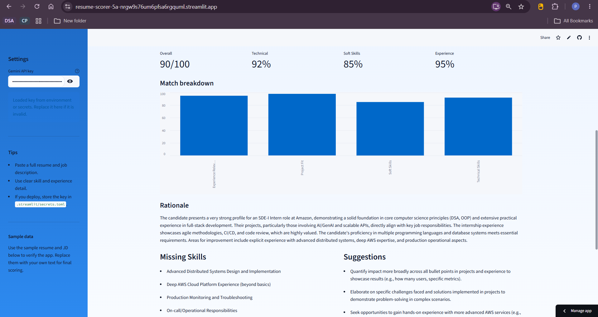
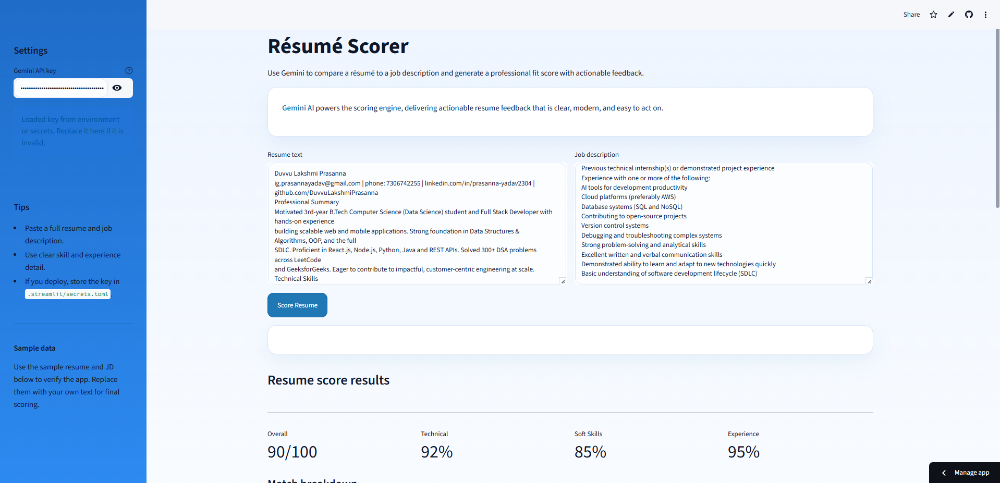

# Resume Scorer

A Streamlit app that compares a resume and job description using Gemini AI. This version is built for Gemini only and focuses on a clean, polished scoring experience. The app includes a polished UI with a sidebar, two-column input layout, score metrics, a bar-chart breakdown, missing skills, suggestions, and learning resources.

**Author:** Duvvu Lakshmi Prasanna

## Live Demo

🔗 [https://resume-scorer-5a-nrgw9s76um6pfsa6rgquml.streamlit.app/](https://resume-scorer-5a-nrgw9s76um6pfsa6rgquml.streamlit.app/)

## Screenshots

### Resume Review


### ATS Score Result


## Setup

1. Create and activate the virtual environment:
```powershell
python -m venv .venv
.\.venv\Scripts\activate
```

2. Install dependencies:
```powershell
pip install -r requirements.txt
```

3. Add your Gemini API key to `.streamlit/secrets.toml`:
```toml
GEMINI_API_KEY="YOUR_KEY"
```

## Run

```powershell
.\.venv\Scripts\python.exe -m streamlit run app.py
```

Then open `http://localhost:8501`.

## Testing

1. Confirm the app loads with:
   - Resume text box
   - Job description text box
   - Gemini API key field in the sidebar
   - Score Resume button

2. Use this sample data to verify the score flow:

### Resume
```text
John Doe
Skills:
Python
Java
DSA
SQL
Projects:
Student Management System
```

### Job Description
```text
Looking for Software Engineer.
Requirements:
Python
Java
SQL
AWS
Problem Solving
```

3. Click **Score Resume** and verify the app returns:
   - Fit score
   - Rationale
   - Missing skills
   - Suggestions
   - Learning resources (if available)

## Common Fixes

- `ModuleNotFoundError: No module named 'streamlit'`
  - Run `pip install streamlit`
- `ModuleNotFoundError: No module named 'google'`
  - Run `pip install google-genai`
- `Invalid API Key`
  - Create or regenerate a Gemini API key in [Google AI Studio](https://aistudio.google.com/?utm_source=chatgpt.com)

## Files

- `app.py` — Streamlit application
- `requirements.txt` — Python dependencies
- `.streamlit/secrets.toml` — Gemini API secret placeholder
- `.streamlit/config.toml` — light-mode theme configuration
- `acceptance_log.md` — lab acceptance log

## UI Improvements

- Wide layout for productivity
- Two-column text input for resume and JD
- Sidebar for API key entry and tips
- Score summary cards and bar chart
- Clear sections for missing skills, suggestions, and learning resources

## Tech Stack

- **Frontend/App Framework:** Streamlit
- **AI Model:** Google Gemini API
- **Language:** Python

## Future Improvements

- Support for multiple resume formats (PDF, DOCX upload)
- Resume builder suggestions based on JD keywords
- History tracking of previous scoring sessions
- Multi-language resume support

## License

This project is open-source and available for personal and educational use.
